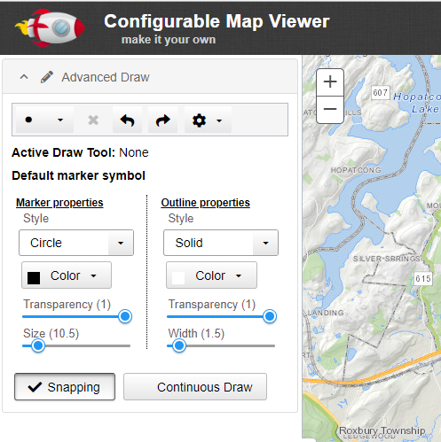
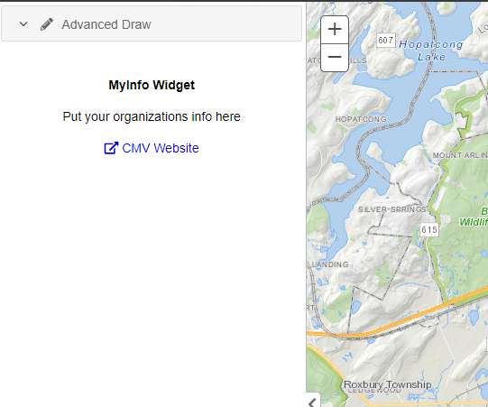
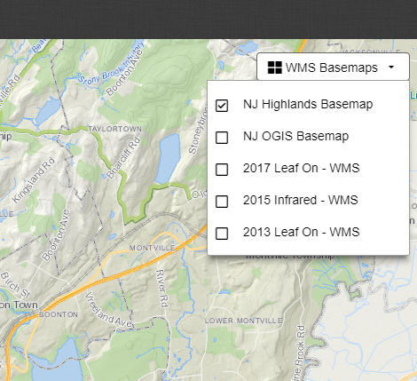

CMV Widgets
===========

Dojo Widgets to extend the functionality of the Esri Javascript API and [CMV](https://github.com/cmv/cmv-app). Documentation on how to use these widgets can be found in their respective folder. While designed to work specifically for CMV, they should function just as well outside of CMV in a different Dojo or Esri API app.

All widgets tested and built on CMV 2.0.0-beta.2.

Check out the widgets [here](https://ishiland.github.io/cmv-widgets/) for a fully functional demo.

### AdvancedDraw
   * Add text to map
   * Undo/Redo drawn features
   * Edit drawn features
   * [View the Documentation](AdvancedDraw/)

   

### MyInfo
  * Display HTML attached to a specified dom node. Works well for displaying your organizations information.
  * [View the Documentation](MyInfo/)

  

### WMSBasemaps
  * Use WMS Layers as Basemaps.
  * [View the Documentation](WMSBasemaps/)

  